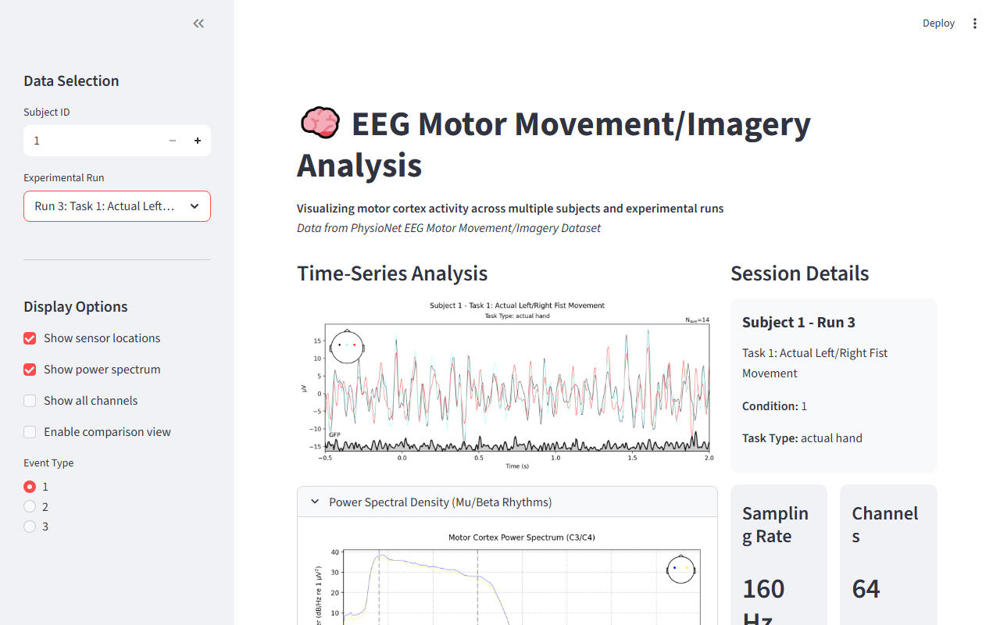
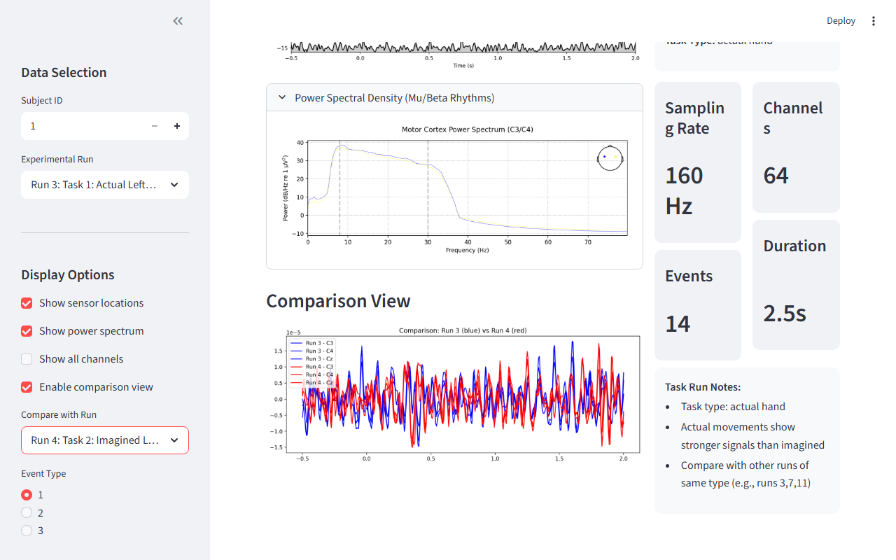

# EEG Motor Imagery Visualizer

Interactive Streamlit app for exploring EEG motor imagery data. I built this as a capstone project for EN.585.771 Biomedical Data Science at Johns Hopkins University (Spring 2025).

You pick a subject and an experimental run from the sidebar, and the app loads the EEG data, preprocesses it, and renders a time-series plot of motor cortex activity, a power spectral density view in the Mu/Beta range, and a comparison view to overlay two runs side by side. All 109 subjects and 14 runs are included.

[Demo video](https://drive.google.com/file/d/1pGV8UOL8_9fwNtRExJd_bbAQDL0SbZQL/view?usp=sharing)

---

## Screenshots





---

## What It Does

The preprocessing pipeline in `loader.py` renames channels from raw EDF format to standard 10-20 names, applies the standard 10-20 montage, bandpass filters to 8-30Hz, and extracts epochs from -0.5s to 2.0s around annotated events. From there you get:

- Time-series plot of motor cortex activity (C3, C4, Cz channels)
- Power spectral density in the 8-30Hz range (Mu and Beta rhythms)
- Side-by-side comparison view to overlay two runs for the same subject
- Session metadata: sampling rate, event count, channel count, epoch duration

---

## Dataset

Uses the [PhysioNet EEG Motor Movement/Imagery Dataset](https://physionet.org/content/eegmmidb/1.0.0/) -- 109 subjects, 14 experimental runs each, 64-channel EEG recorded at 160Hz.

| Run | Description |
|-----|-------------|
| 1 | Baseline (eyes open) |
| 2 | Baseline (eyes closed) |
| 3 | Actual left/right fist movement |
| 4 | Imagined left/right fist movement |
| 5 | Actual both fists/feet movement |
| 6 | Imagined both fists/feet movement |
| 7-14 | Repeated blocks of runs 3-6 |

Events are labeled T0 (rest), T1 (left fist or both fists), T2 (right fist or feet) per the BCI2000 annotation spec. Baseline runs have no event annotations, so the app inserts a synthetic event at the recording midpoint for epoch extraction.

---

## Running Locally

**1. Get the data**

The EDF files are included in `data/` in this repo. If you want to download them directly from PhysioNet instead:

```bash
wget -r -N -c -np https://physionet.org/files/eegmmidb/1.0.0/
```

Expected structure: `data/S001/S001R01.edf`, `data/S001/S001R01.edf.event`, etc.

**2. Install dependencies**

```bash
pip install -r requirements.txt
```

**3. Run the app**

```bash
streamlit run app.py
```

Opens at `http://localhost:8501`.

---

## Tech Stack

- Python, Streamlit
- MNE-Python (EDF loading, channel renaming, montage, bandpass filtering, epoching)
- NumPy, Matplotlib

---

## Known Limitations

- **No classifier.** This is a visualization tool. No model is trained or evaluated here.
- **Epoch averaging hides variability.** The comparison view averages across all epochs for a run, so trial-by-trial differences are not visible.
- **Baseline epochs are placeholders.** Baseline runs have no event annotations, so the app inserts a synthetic midpoint event. The epoch extracted is not meaningful as a task epoch, just a convenience for consistent display.
- **Channel renaming is dataset-specific.** The renaming logic is hardcoded to the dotted naming convention in this dataset's EDF files. Other EDF datasets will break it.

---

## If I Were to Continue This

- **CSP + LDA classifier.** The standard starting point for motor imagery decoding. You filter the EEG spatially, extract features from the covariance structure, and train a subject-specific left vs. right fist decoder. With 109 subjects and multiple runs each, there is enough data to do this properly and report accuracy across subjects.
- **ERD/ERS analysis.** The Mu rhythm (8-12Hz) suppresses during motor execution and imagery, which is what the PSD is gesturing at. To actually quantify it you need time-frequency analysis on individual trials rather than averaged epochs. Morlet wavelets would let you see whether that suppression is consistent and whether it differs between actual and imagined movement.
- **Trial-by-trial view.** Right now the comparison averages all epochs, which hides individual variability. Showing single trials would give a more honest picture of the data.
- **Cross-subject generalization.** Train on N-1 subjects, test on one, and see how well features transfer between people.

---

## Citations

Schalk, G., McFarland, D.J., Hinterberger, T., Birbaumer, N., Wolpaw, J.R. BCI2000: A General-Purpose Brain-Computer Interface (BCI) System. *IEEE Transactions on Biomedical Engineering* 51(6):1034-1043, 2004.

Goldberger, A., Amaral, L., Glass, L., Hausdorff, J., Ivanov, P. C., Mark, R., ... & Stanley, H. E. (2000). PhysioBank, PhysioToolkit, and PhysioNet: Components of a new research resource for complex physiologic signals. *Circulation* 101(23), e215-e220.

---

## Context

Capstone project for EN.585.771 Biomedical Data Science (JHU, Spring 2025). The goal was to work with a real biosignal dataset end-to-end: loading EDF files, preprocessing with MNE-Python, and building an interactive visualization layer on top. Motor imagery sits alongside P300 and SSVEP as one of the main paradigms in non-invasive BCI research, and it comes up a lot in rehabilitation contexts: stroke patients relearning movement, hands-free control for people with limited motor function. I chose this dataset specifically because it is one of the most used benchmarks in the BCI literature, so working through it gave me a concrete sense of what this kind of data actually looks like before trying anything more involved.
